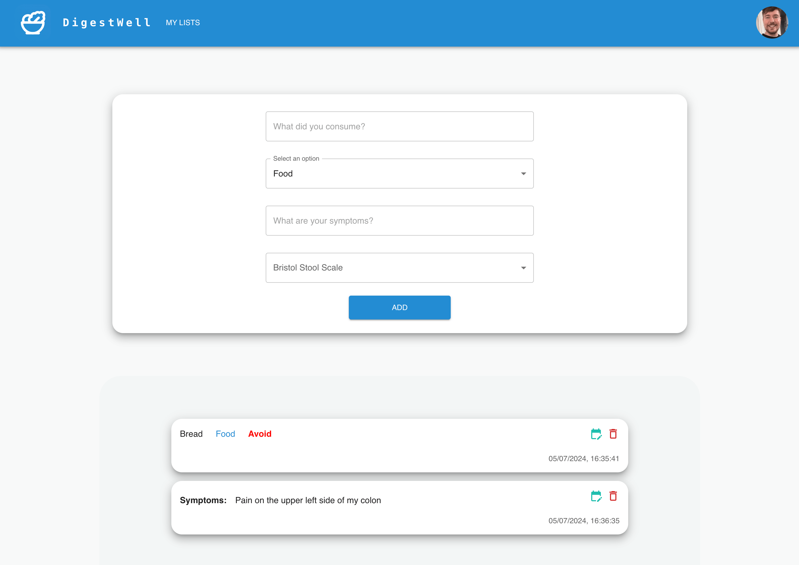
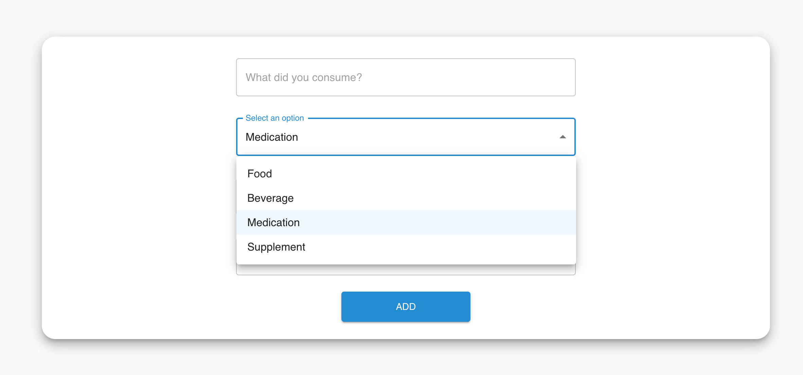
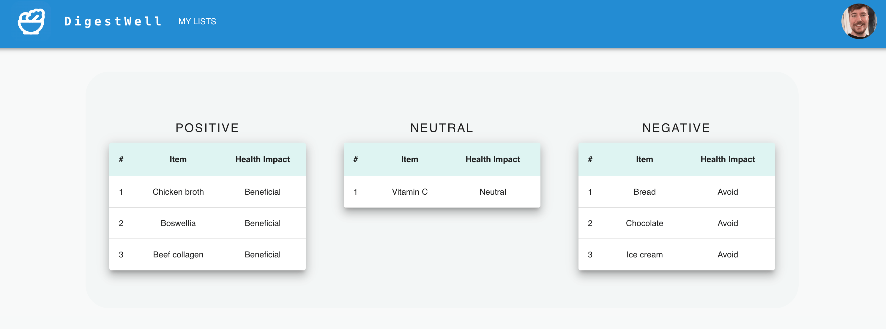

## DigestWell

  

DigestWell was built to help patients suffering from Irritable Bowel Disease (Ulcerative Colitis and Crohn's disease) effectively track their intake of food, beverages, medications, and supplements.

## Screenshots

  
  
  

## Getting started
1. Start with the regular suspects; git, Node and npm.

2. Create a database named `digestwell` in your PostgreSQL instance.

3. Hard code a user ID in the table named 'users' inside your local PostgreSQL database.

## Run the client

`cd client`
`npm run dev`

## Run the server

`cd server`
`npx nodemon index.js `

## Tech Stack
* [React](https://react.dev)
* [Material UI](https://mui.com/material-ui)
* [Express](https://mui.com/material-ui)
* [Sequelize](https://sequelize.org/)
* [PostgreSQL](https://www.postgresql.org/)

## Developer
* Brice Fromm [GitHub](https://github.com/Elsass1) - [LinkedIn](https://www.linkedin.com/in/frommbrice)
